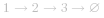
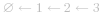
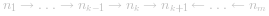
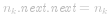

#### 方法一：迭代

假设存在链表  ，我们想要把它改成  。

在遍历列表时，将当前节点的   指针改为指向前一个元素。由于节点没有引用其上一个节点，因此必须事先存储其前一个元素。在更改引用之前，还需要另一个指针来存储下一个节点。不要忘记在最后返回新的头引用！

```Java [sol1-Java]
class Solution {
    public ListNode reverseList(ListNode head) {
        ListNode prev = null;
        ListNode curr = head;
        while (curr != null) {
            ListNode nextTemp = curr.next;
            curr.next = prev;
            prev = curr;
            curr = nextTemp;
        }
        return prev;
    }
}
```


**复杂度分析**

* 时间复杂度：*O(n)*，假设 *n* 是列表的长度，时间复杂度是 *O(n)*。
* 空间复杂度：*O(1)*。

#### 方法二：递归

递归版本稍微复杂一些，其关键在于反向工作。假设列表的其余部分已经被反转，现在我们应该如何反转它前面的部分？

假设列表为：
 

若从节点 *n_{k+1}* 到 *n_{m}* 已经被反转，而我们正处于 *n_{k}*。

 

我们希望 *n_{k+1}* 的下一个节点指向 *n_{k}*。

所以， 。

要小心的是 *n_{1}* 的下一个必须指向   。如果你忽略了这一点，你的链表中可能会产生循环。如果使用大小为 *2* 的链表测试代码，则可能会捕获此错误。

```Java [sol2-Java]
class Solution {
    public ListNode reverseList(ListNode head) {
        if (head == null || head.next == null) {
            return head;
        }
        ListNode p = reverseList(head.next);
        head.next.next = head;
        head.next = null;
        return p;
    }
}
```


**复杂度分析**

* 时间复杂度：*O(n)*，假设 *n* 是列表的长度，那么时间复杂度为 *O(n)*。
* 空间复杂度：*O(n)*，由于使用递归，将会使用隐式栈空间。递归深度可能会达到 *n* 层。